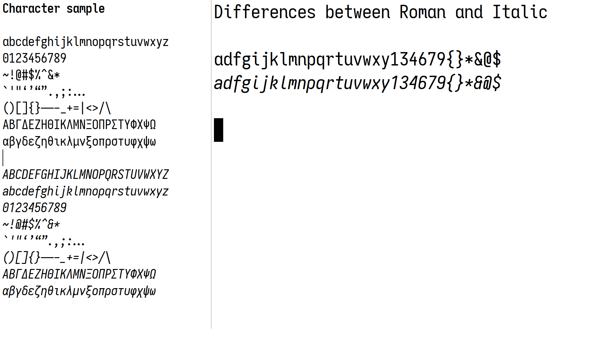
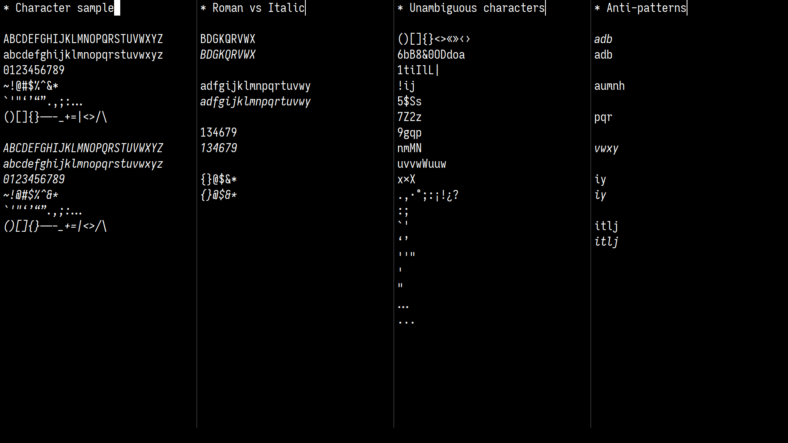
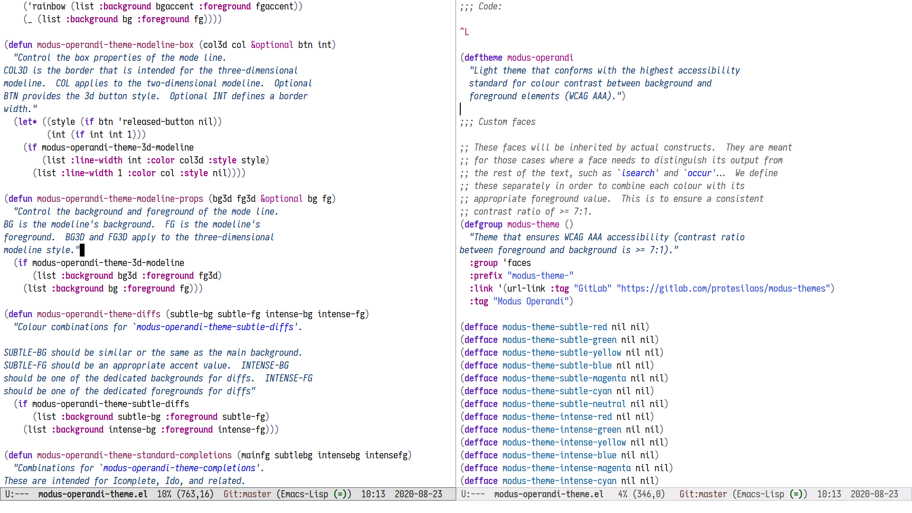
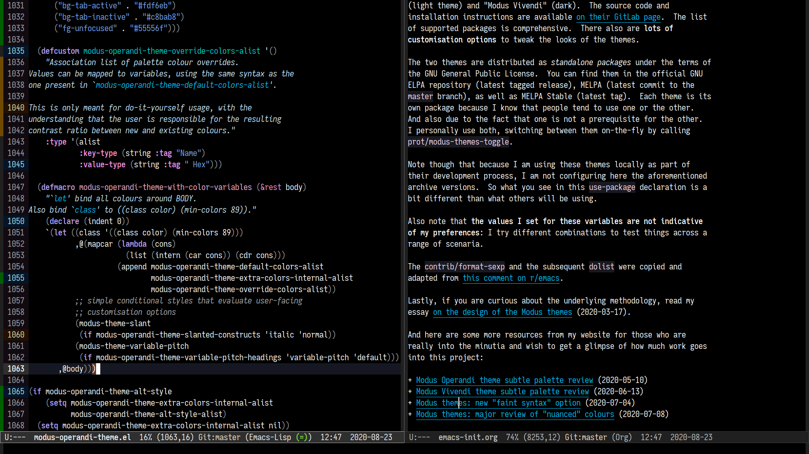

Iosevka Comfy
=============

Private build of the Iosevka monospaced font, configured in accordance
with the documentation of the upstream project:
https://github.com/be5invis/Iosevka

The files are provided as-is in the hope that they may prove useful.

**Updates will be made whenever upstream introduces new character
variants that could prove useful to this project.**

Screen shots
------------

My Emacs session, running the Modus themes:
https://gitlab.com/protesilaos/modus-themes

