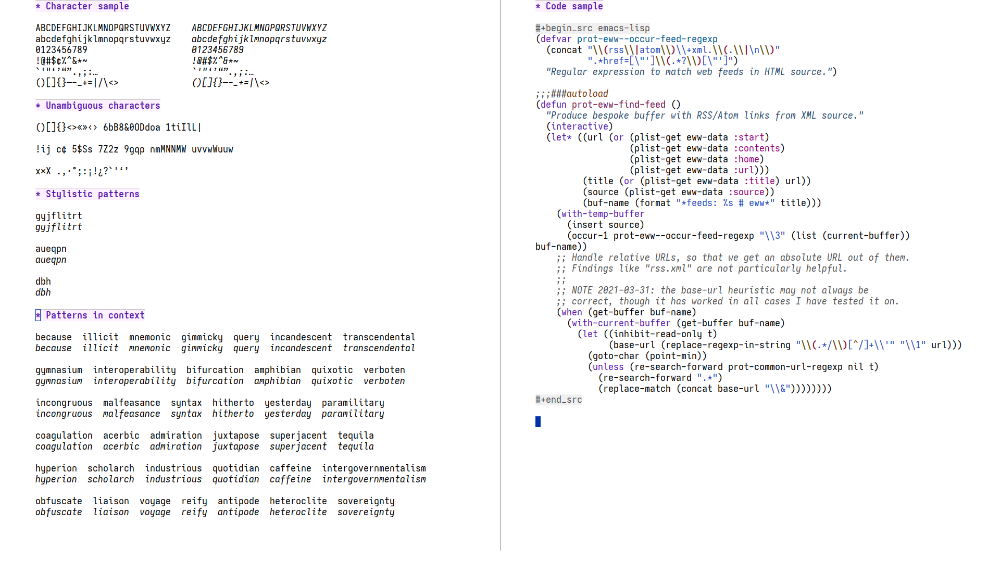
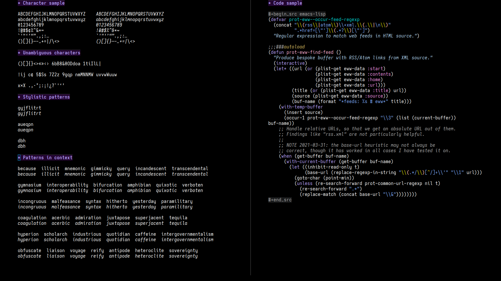

Iosevka Comfy
=============

Private build of the Iosevka monospaced font, with adjusted metrics and
lots of overrides for individual glyphs at both roman and ital variants.

Configured in accordance with the documentation of the upstream project:
<https://github.com/be5invis/Iosevka>.  Last update on 2021-04-22 using
Iosevka version `v6.0.0-preview.4` commit `2b144b0e`.

The files are provided as-is in the hope that they may prove useful, but
are otherwise intended only for my private use.

