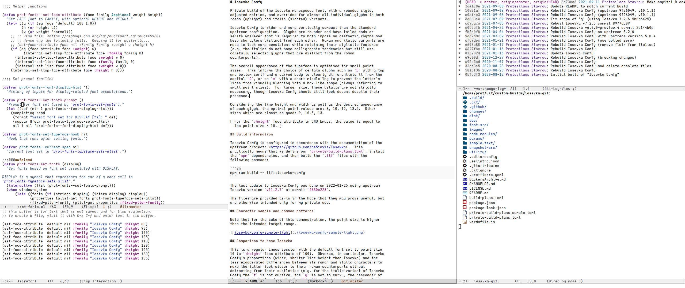
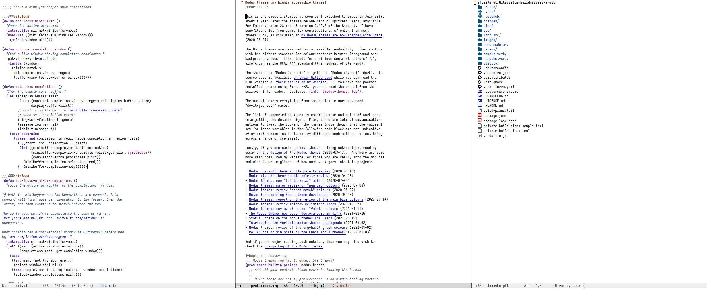

# Iosevka Comfy

Private build of [Iosevka](https://github.com/be5invis/Iosevka), with a
rounded style and open shapes, adjusted metrics, and overrides for
almost all individual glyphs in both roman (upright) and italic
(slanted) variants.


## Details of the typeface

Iosevka Comfy is more vertically compact than the standard upstream
configuration.  Glyphs are rounder and have tailed ends or serifs only
when those are required to both impose a predictable rhythm and keep
characters distinct from each other.

The round and open shapes, tailed ends, and earless shoulders, can be
discerned in those patterns:

* `a`, `o`, `u` (e.g. `anonymous`);
* `i`, `t`, `l` (e.g. `illicit`);
* `j`, `g`, `y` (e.g. `jiggly`);
* `b`, `d` (e.g. `bidirectional`);
* `n`, `m` (e.g. `numeral`);
* `p`, `q` (e.g. `equip`);
* `6`, `9`, `&`.

### Considerations for romans and italics

Roman and italic variants are made to look more consistent while
retaining their stylistic features.  Unlike the default Iosevka style,
the upright glyphs do not have a mixture of straight/blocky and curved
or serified characters (special exceptions notwithstanding).  While the
italics do not have calligraphic tendencies that would greatly contrast
with their counterparts.  The differences within each character set and
between the variants themselves are nuanced.  The intent is to make
everything feel part of the same aesthetic.  Distinctions are drawn on
the premise of contributing to the demands of the design without ever
calling attention to themselves.

For italics, the earless shoulders in glyphs such as `n`, `m`, `p`, `q`
change slightly to have a sturdier top which helps compensate for the
added slant.  Otherwise they would feel more rounded than their roman
counterparts.  We do not want that added implicit emphasis because the
slant is already enough: to emphasise the emphasis is the kind of
exaggeration that Iosevka Comfy strives to eliminate.

### The target of small point size

The overall appearance of the typeface is optimised for small point
sizes.  This informs the choice of certain glyphs that break the
established patterns:

* The `a` has a serified or more blocky end even though other glyphs
  have tailed ends.  This is because at small point sizes the single
  storey `a` can be mistaken for an `o` as the tail is too subtle.  The
  serif fixes that.  Why single storey?  Because a double storey is too
  blocky at small sizes.

* The `D` has a top and bottom serif and a curved body to disambiguate
  it from the capital `O`.

* Same principle for `I` whose serifs help one tell it apart from `l`.

* The `m` has a short middle leg to prevent the letter's lines from
  visually blending into a box-like shape (as is the case with the
  default Iosevka at small point sizes).  It otherwise exhibits the same
  rounded/earless patterns.

It is important to stress that these decisions are made in light of the
target range of point sizes, which is between 8 and 13.  If we were to
design towards another end, then we would do things differently (the
open shapes would not be necessary, the aforementioned exceptions would
not be required, and so on).

Optimal point sizes for the author are: 8, 10, 11, 13.  While "false
friends" which increase the height of characters without actually
adjusting the line width and height are: 10.5, 12, 13.5.  We call them
"false friends" because while they appear to have an effect, they do not
actually increase the size of the font consistently: they break
expectations and make the overall appearance feel more vertically
compact than it should be.

[ For the `:height` face attribute in GNU Emacs, the value is equal to
  the point size × 10. ]

## Comparison to base Iosevka

This is a regular Emacs session with the default font set to point size
10 (a `:height` face attribute of 100).





## Build information

Iosevka Comfy is configured in accordance with the documentation of the
upstream project.  This practically means that we define our
`private-build-plans.toml`, install the `npm` dependencies, and then
build the `.ttf` files with the following command:

```sh
npm run build -- ttf::iosevka-comfy
```

The last update to Iosevka Comfy was done on 2022-01-26 using upstream
version `v11.2.7`.

Each file is provided as-is in the hope that it may prove useful, but
is otherwise intended only for my private use.
