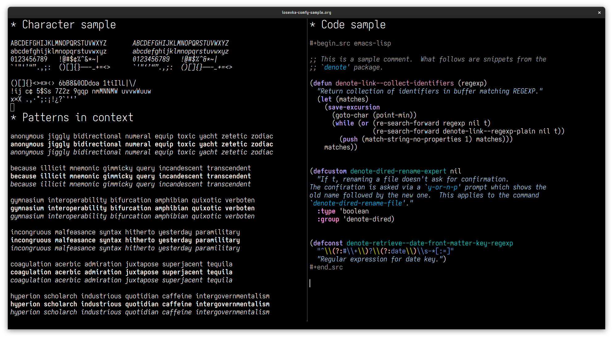
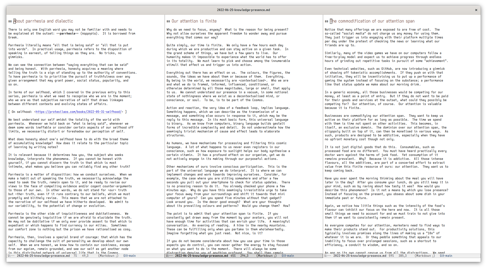
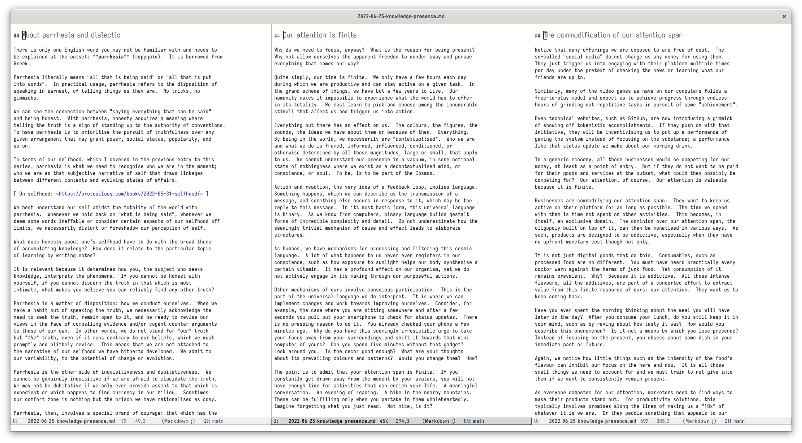
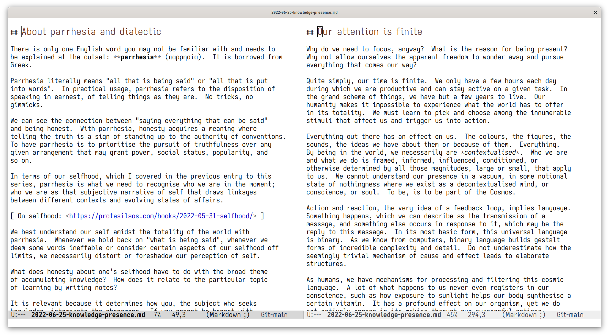

# Iosevka Comfy

highly customised build of the [Iosevka
typeface](https://github.com/be5invis/Iosevka), with a rounded style and
open shapes, adjusted metrics, and overrides for almost all individual
glyphs in both roman (upright) and italic (slanted) variants.




## Details of the typeface

Iosevka Comfy is more vertically compact than the standard upstream
configuration.  Glyphs are rounder and have tailed ends or serifs only
when those are required to both impose a predictable rhythm and keep
characters distinct from each other.

The round and open shapes, tailed ends, and earless shoulders, can be
discerned in those patterns:

* `a`, `o`, `u` (e.g. `anonymous`);
* `i`, `t`, `l` (e.g. `illicit`);
* `j`, `g`, `y` (e.g. `jiggly`);
* `b`, `d` (e.g. `bidirectional`);
* `n`, `m` (e.g. `numeral`);
* `p`, `q` (e.g. `equip`);
* `6`, `9`, `&`.

### Considerations for romans and italics

Roman and italic variants are made to look more consistent while
retaining their stylistic features.  Unlike the default Iosevka style,
the upright glyphs do not have a mixture of straight/blocky and curved
or serified characters (special exceptions notwithstanding).  While the
italics do not have calligraphic tendencies that greatly contrast with
their counterparts.  The differences within each character set and
between the variants themselves are nuanced.  The intent is to make
everything feel part of the same aesthetic.  Distinctions are drawn on
the premise of contributing to the demands of the design without ever
calling attention to themselves (as opposed to sporadic calligraphic
glyphs amid an otherwise austere presentation).

For italics, the earless shoulders and rounded bottom in the glyphs `a`,
`b`, `d,` `n`, `m`, `p`, `q`, `u` change slightly to have a sturdier
ending which helps compensate for the added slant.  Otherwise they would
feel more rounded than their roman counterparts.  We do not want that
added implicit emphasis of extra roundedness because the slant is
already sufficient: to emphasise the emphasis is the kind of
exaggeration that Iosevka Comfy strives to eliminate.

### The target of small point size

The overall appearance of the typeface is optimised for small point
sizes.  This informs the choice of certain glyphs that break the
established patterns:

* The `D` has a top and bottom serif and a curved body to disambiguate
  it from the capital `O` (which is more round).  At small point sizes,
  our `TODO` looks clear whereas with a non-serif `D` it reads like
  `TOOO` (the `D` is almost the same as an `O`).

* Same principle for `I` whose serifs help one tell it apart from `l`.

* The `m` has a short middle leg to prevent the letter's lines from
  visually blending into a box-like shape (as is the case with the
  default Iosevka at small point sizes).  It otherwise exhibits the same
  rounded/earless patterns.

[ Also read the section "Deviations from the regular style". ]

The target of small point sizes also informs the decision to use squared
punctuation marks and a dotted `%` sign (the percent looks like `./.`
instead of `o/o`).  They look more crisp.

It is important to stress that these decisions are made in light of the
target range of small point sizes, which for the author is between 8
and 13.  If we were to design towards another end, then we would do
things differently (the open shapes would not be necessary, the
aforementioned exceptions would not be required, punctuation marks could
be circular, and so on).

Optimal small point sizes for the author are: 8, 10, 11, 13.  While
"false friends" which increase the height of characters without actually
adjusting the line width and height are: 10.5, 12, 13.5.  We call them
"false friends" because while they appear to have an effect, they do not
actually increase the size of the font consistently: they break
expectations and make the overall appearance feel more vertically
compact than it should be.

Those granted, Iosevka Comfy looks decent at larger point sizes.  The
author uses it for presentations because its open shapes make it easy to
read.

[ For the `:height` face attribute in GNU Emacs, the value is equal to
  the point size × 10. ]

## Comparison to base Iosevka

This is a regular Emacs session with the default font set to point size
10 (a `:height` face attribute of 100).  In the first picture we have
Iosevka Comfy and regular Iosevka in the second.  Notice how Iosevka
Comfy is more vertically compact, while you can also discern the stylic
differences between the two typefaces.





And the same idea with the point size at 17 (Emacs `:height` 170):




## Variants

Iosevka Comfy comes in five variants, all of which share the same
stylistic overrides, as documented above.

* `iosevka-comfy` is monospaced and supports ligatures.  Apart from
  ligatures, it allows certain glyphs, such as arrows, to occupy more
  than one block.

* `iosevka-comfy-fixed` is strictly monospaced and does not support
  ligatures.  All glyphs are exactly the same width.  Use this if you
  prefer it or if your application (e.g. terminal emulator) does not
  recognise `iosevka-comfy` as a monospaced font.

* `iosevka-comfy-duo` is quasi-proportional and supports ligatures.  The
  naturally wide glyphs, such as `m`, are allowed to occupy two blocks
  instead of one.

* `iosevka-comfy-wide` is the same as `iosevka-comfy` except it is
  noticeably wider.  It also looks taller than `iosevka-comfy` even
  though both variants fit the same number of lines on a screen.

* `iosevka-comfy-wide-fixed` same as `iosevka-comfy-wide` though it is
  strictly monospaced and does not support ligatures.

## Deviations from the regular style

The variants of Iosevka Comfy are subdivided into "narrow" and "wide".
The former consists of `iosevka-comfy` and `iosevka-comfy-fixed`.  The
latter includes `iosevka-comfy-wide`, `iosevka-comfy-wide-fixed`, and
the quasi-proportional `iosevka-comfy-duo`.

Due to the relaxed spacing requirements and concomitant legibility
considerations, the wide variants have stylistic deviations from their
counterparts.  In detail:

* The `m` character has three legs of equal length, insetad of a shorter
  middle leg.  The short middle leg in the narrow variants is necessary
  for legibility, especially at small point sizes (otherwise the
  character's legs visually blend into what appears to be a solid
  block).

* The `0` has a forward slash that cuts diagonally through the middle of
  the circle, connecting the bottom left part to the top right of the
  oval shape.  Whereas the narrow variants have a dashed forward slash
  which does not connect the two sides as it is positioned inside the
  oval shape.

## Install on GNU/Linux

Unless you have some exotic system, in which case you know what you are
doing, you can install fonts for your local user by copying the `.ttf`
files or their directories in `~/.local/share/fonts/`.  For system-wide
installation, place them in `/usr/share/fonts/`.

Depending on your system, you may need to delete the `ttf` or
`ttf-unhinted` builds.  Though this is not strictly necessary, as the
system knows which one to pick.

When in doubt, install locally.

## Build information

Iosevka Comfy is configured in accordance with the documentation of the
upstream project.  This practically means that we define our
`private-build-plans.toml`, install the `npm` dependencies, and then
build the `.ttf` files with something like the following for each
variant:

```sh
npm run build -- ttf::iosevka-comfy
```

It seems that queueing the builds, such as with a `for` loop, does not
work as intended: the variants are not differentiated from the base
`iosevka-comfy` build.

The last update to Iosevka Comfy was done on 2022-07-21 using upstream
version `v15.6.0`, commit `254f75f7`.

Each file is provided as-is in the hope that it may prove useful, but
is otherwise intended only for my private use.
