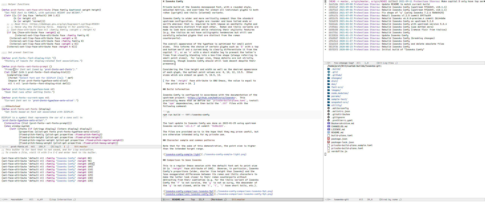

# Iosevka Comfy

Private build of the Iosevka monospaced font, with a rounded style,
adjusted metrics, and overrides for almost all individual glyphs in both
roman (upright) and italic (slanted) variants.

Iosevka Comfy is wider and more vertically compact than the standard
upstream configuration.  Glyphs are rounder and have tailed ends or
serifs wherever those are required to both impose an aesthetic rhythm
and keep characters distinct from each other.  Roman and italic variants
are made to look more consistent while retaining their stylistic
features (e.g. the italics do not have calligraphic tendencies that
greatly contrast with more rigid or straight roman shapes, but still use
carefully selected glyphs that are distinct from their roman
counterparts albeit in more nuanced ways).

The overall appearance of the typeface is optimised for small point
sizes.  This informs the choice of certain glyphs such as `D` with a top
and bottom serif and a curved body to clearly differentiate it from the
capital `O`, or an `m` with a short middle leg to prevent the letter's
lines from visually blending into a box-like shape (always referring to
small point sizes).  For larger sizes, these details are not strictly
necessary, though Iosevka Comfy should still look decent despite their
presence.

Considering the line height and width as well as the desired appearance
of each glyph, the optimal point values are: 8, 10, 12, 13.  Other sizes
which are almost as good: 9, 10.5, 13.5.

[ For the `:height` face attribute in GNU Emacs, the value is equal to
  the point size × 10. ]

## Build information

Iosevka Comfy is configured in accordance with the documentation of the
upstream project: <https://github.com/be5invis/Iosevka>.  This
practically means that we define our `private-build-plans.toml`, install
the `npm` dependencies, and then build the `.ttf` files with the
following command:

```sh
npm run build -- ttf::iosevka-comfy
```

The last update to Iosevka Comfy was done on 2022-01-25 using upstream
Iosevka version `v11.2.7` at commit `f630c223`.

Each file is provided as-is in the hope that it may prove useful, but
is otherwise intended only for my private use.

## Character sample and common patterns

Note that for the sake of this demonstration, the point size is higher
than the intended target range.


## Comparison to base Iosevka

This is a regular Emacs session with the default font set to point size
10 (a `:height` face attribute of 100).  Obverse, in particular, Iosevka
Comfy's proportions (wider, shorter line height than Iosevka) and the
less exaggerated differences between its roman and italic characters to
make the latter look closer to their roman counterparts without
detracting from their subtleties (e.g. for the italic variant of Iosevka
Comfy the `f` is not cursive, the `y` is not so curvy, the descender of
the `g` is not closed, while the `t`, `i`, `l` have short tails, etc.).


For Iosevka Comfy to have roughly the same line width as Iosevka, it has
to be set at one point less.  It still has a more compact line height.
Compare the following screenshot to the one above:


